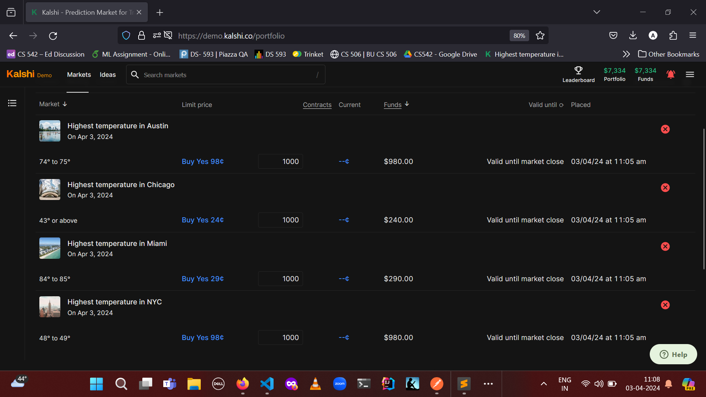
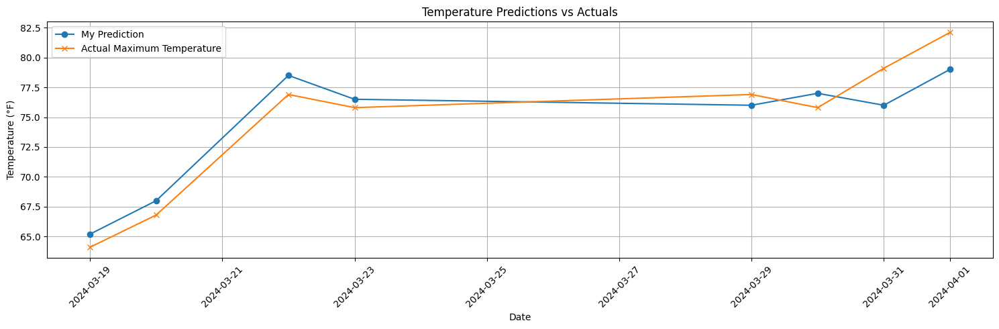
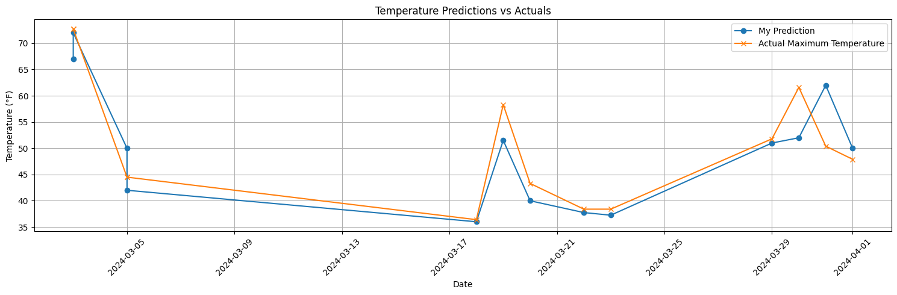
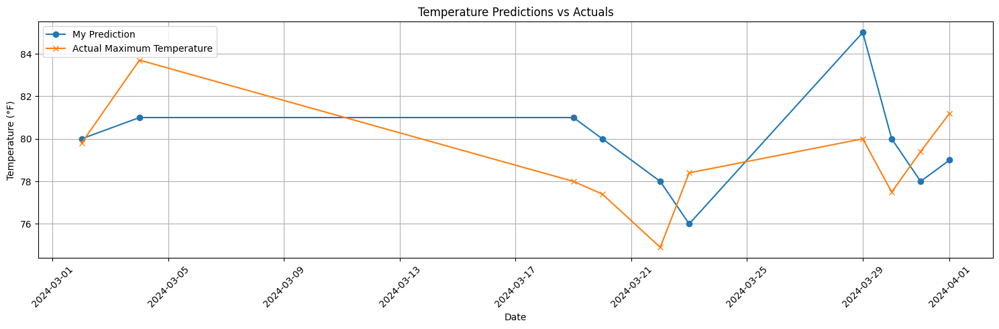
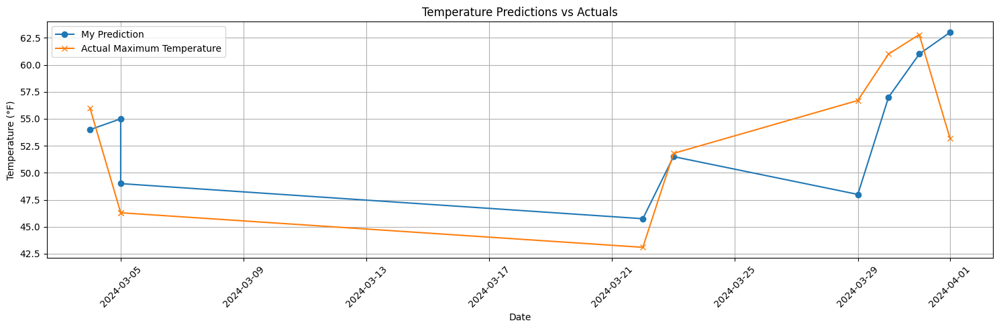

# CS-542 Principles of Machine Learning - Common Task Report

### Submitted by: Arunesh Kumar Lal (U26502933)

## Project Overview

The goal of this project was to predict daily climate events in four major cities using machine learning models. 
The project was structured into three stages over three weeks, as outlined below:
Screenshot[Common Task Docs\Screenshot 2024-03-19 081218.png]
### Week 1: Manual Trading on Kalshi Platform
- Utilized online data sources to predict the maximum temperature in four cities: NYC, Miami, Austin, and Chicago.
- Placed trades on the Kalshi demo platform based on predictions from data sources.

### Week 2: Data Collection and Model Training
- Identified five different data sources for predicting daily climate events.
- Collected historical data to train a machine learning model for predicting the daily maximum temperature.
- Visualized predicted vs. actual values to assess model performance.
- Made daily manual trades using model predictions.

### Week 3: Automated Prediction and Trading
- Automated the trading process using predictions from the trained model.
- Integrated the Kalshi API for automatic trade placement based on predicted temperatures.

---

## Overview of my work
### Data Sources for Manual Prediction
- The Weather Channel
- Accu Weather 
- The Washington Post news on Weather prediction apps

### Event:
Once I set up my account with $10.5K in the demo Kalshi Account. I started placing trades on The highest temperature for each city. 
I have only considered Settled trades for my final report. 
Event Tickers: 
- nycTicker = 'HIGHNY'
- ausTicker = 'HIGHAUS'
- chiTicker = 'HIGHCHI'
- miaTicker = 'HIGHMIA'
I placed a trade based on weekly assigned task for max temp. of each city for that particular day. If by the end-of-day the maximum temperature of the city is in some range, say x to y, then the market resolves to 'yes' for that value, i.e., "x to y" market will resolve to yes. And normally y-x = 1. Hence accuracy and precision play an important role in selecting the correct event. 

### Dataset:
I collected my dataset majorly from the website of "*Visual Crossing*". I extracted 3 years data for each city in csv.
Five Data Sources identified:
- National Centers for Environmental Information (NCEI) - (https://www.ncei.noaa.gov/cdo-web/datasets)
- The European Centre for Medium-Range Weather Forecasts (ECMWF) - 
  (https://www.ecmwf.int/en/forecasts/dataset/ecmwf-reanalysis-v5)
- National Weather Service (NWS) - Visual Cross Reference 
- Open-Meteo (https://open-meteo.com/)
- The Japanese Meteorological Agency (https://www.data.jma.go.jp/obd/stats/data/en/index.html)
- National Oceanic and Atmospheric Administration (NOAA)

The dataset has the previous three year's historical data for NYC,Chicago,Miami, and Austin's temperature.
The features/labels (column names) of the dataset are as follows:
1. tmin : The minimum temperature of that day.
2. tmax : The maximum temperature of that day.
3. cloudcover: the fraction of the sky obscured by clouds on average when observed from a particular location.
4. windgust:Is a sudden, brief increase in speed of the wind
5. humidity:a measure of water vapor in the air
etc. there were around 28 features in the data 

There were many such features to consider, I selected these 5 based on their relevance in weather prediction.
Let's analyze other features:
Our model will predict the next day's maximum temperature of all the 4 cities, i.e., the "*tempmax*" feature for the next day will be the output of the model.
Input will be the previous years data points, i.e., all the features (including tmax) from the previous few years.
Based upon this historical data, our model will try to predict the next day's "tmax" output feature.

### Model:
I have made use of the XGBoost(eXtreme Gradient Boosting)  algorithm which implements gradient boosting trees with additional improvements for better speed and performance. Making it ideal for time-series forcasting.
Forecasting in data science and machine learning is a technique used to predict future numerical values based on historical data collected over time, either in regular or irregular intervals.

#### Optimizer Used:
1. Introduction to Model Optimization
The purpose of optimization was to reduce the MSE, and fine tune the model while avoiding overfitting.
For temp max prediction fine tuning the model was a requirement as the dataset and features selected were limited and as mentioned in reports weather predictions are 85% accurate on a given day. 
2. Hyperparameter Selection
    The hyperparameter adjusted in the model and its role in the learning process:
    n_estimators: The number of trees in the ensemble. Increasing this number can improve model accuracy up to a point, beyond which the model might overfit.

    max_depth: The maximum depth of a tree. Controls the complexity of the model. Deeper trees can capture more complex patterns but may lead to overfitting.

    learning_rate: Also known as the "eta" value, it determines the step size at each iteration while moving toward a minimum of a loss function. A smaller learning rate requires more boosting rounds but can lead to a better generalized model.

    colsample_bytree: The fraction of features (columns) used per tree. A lower value provides more regularization.

    subsample: The fraction of instances (rows) used for each tree. Lower values prevent overfitting but too low can lead to underfitting.

    reg_alpha and reg_lambda: These are L1 (Lasso regression) and L2 (Ridge regression) regularization terms on weights, respectively. They add a penalty on large coefficients to prevent overfitting.

    random_state: Ensures reproducibility of results by setting a seed for the random number generator used in XGBoost.

    early_stopping_rounds: Stops training if the validation metric does not improve for a specified number of boosting rounds. Helps in preventing overfitting.

3. Optimization Methodology 
   It was mostly trial and error by checking MSE and gridsearch used for automated hyperparameter tuning.

4. Impact on Model Performance:
There were fluctuations in model's performance going off by 10F or being close to 1F, used MSE to quantify the improvements.

5. Conclusion
The project was a great learning experience. I think there is more scope in weather forecasting in my model, based on discussion with peers, the dataset size and feature set can be increased to further enhance the model. Automating the trades was a good learning experience.
#### Loss Function Used:
Mean Squared Error 
Please refer file : MSE of Settled Trades.ipynb
## Final Outputs

### Temperature Predictions vs Actuals

#### Austin

- Overall Mean Square Error: 3.4

#### Chicago

- Overall Mean Square Error: 27.4

#### Miami

- Overall Mean Square Error: 7.6

#### New York City (NYC)

- Overall Mean Square Error: 31.6

## How to Run
1. Clone the repository.
2. Install required packages: `pip install -r requirements.txt`
3. To automate trading, configure the API credentials and execute the automation script.

## Model Training Code:
Please refer to the file: `Final_Prediction_Model.ipynb`

## API Automated Trading:
Please refer to the file: `KalshiTradingV2.ipynb`

### How to Run the Project
To run the project, execute the following two notebooks in the given order:
1. `Final_Prediction_Model.ipynb` - Train the machine learning model for climate prediction.
2. `KalshiTradingV2.ipynb` - Automate the trading process based on the model predictions.
